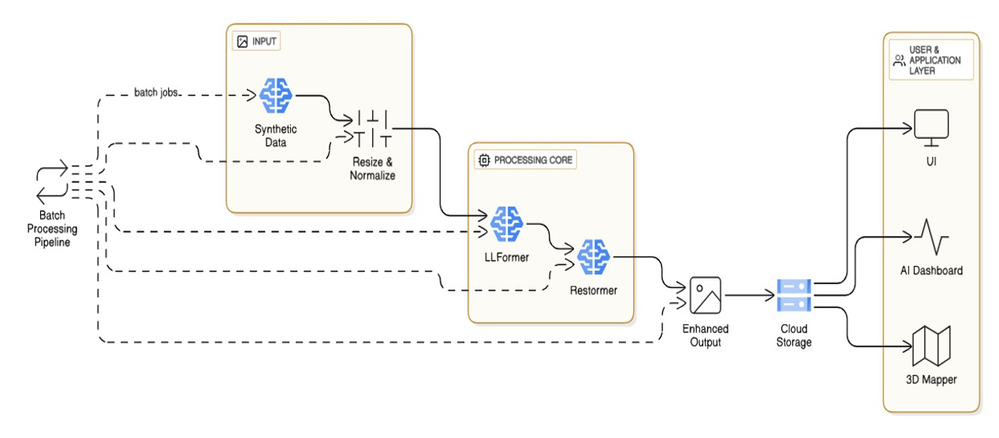
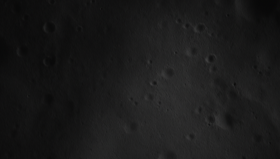
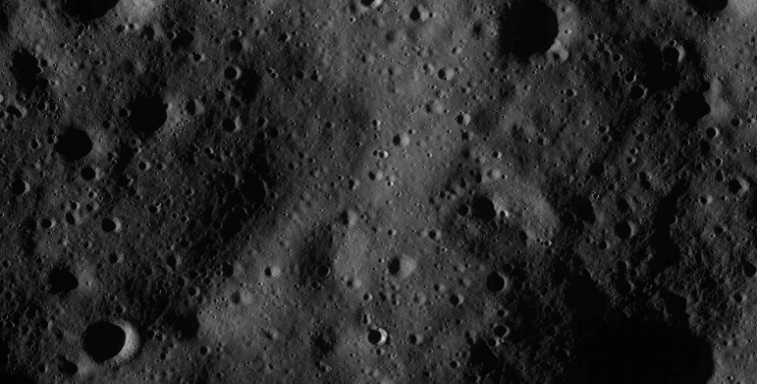

# 🌙 Low-Light Image Enhancement and Noise Removal for Lunar Mapping

> A **transformer-based pipeline** that combines **LLFormer** and **Restormer** to enhance low-light lunar images captured from Permanently Shadowed Regions (PSRs). The pipeline first enhances image illumination using LLFormer and then removes residual noise using Restormer, producing high-quality images for lunar surface analysis and mapping.

---

# 📖 Overview

Lunar images captured from Permanently Shadowed Regions (PSRs) often suffer from extremely low illumination, poor contrast, and noise, making scientific analysis difficult. This project proposes a **transformer-based pipeline** where **LLFormer** enhances the low-light image and **Restormer** restores the enhanced image by removing residual noise. The final output provides improved visibility, preserved surface details, and enhanced image quality suitable for lunar mapping and exploration.

---

# ✨ Key Features

* Transformer-based image enhancement pipeline
* Low-light enhancement using **LLFormer**
* Image denoising using **Restormer**
* Image normalization and resizing (256 × 256)
* Enhanced lunar surface visualization
* Preservation of structural details and textures
* High-quality output for lunar mapping

---

# 🏗️ System Architecture

The proposed architecture consists of three major components:

### **Input Layer**

* Accepts low-light lunar images.
* Performs image normalization and resizing to **256 × 256**.

### **Processing Core**

* **LLFormer:** Enhances illumination and image contrast.
* **Restormer:** Removes residual noise while preserving image details.

### **User Application Layer**

* Displays or stores the enhanced image for visualization, 3D mapping, AI-based evaluation, and lunar surface analysis.

## 📌 System Architecture Diagram
---
<p align="center"> 
         
</p>
---

# 🔄 Pipeline

```text
Input Lunar Image
        │
        ▼
Image Preprocessing
(Normalization & Resize to 256 × 256)
        │
        ▼
LLFormer
(Image Enhancement)
        │
        ▼
Enhanced Image
        │
        ▼
Restormer
(Image Denoising)
        │
        ▼
Final Enhanced Image
        │
        ▼
User Application Layer
```

---

# 📊 Results

The proposed pipeline significantly improves image illumination, removes residual noise, and preserves important lunar surface details. The output demonstrates better visibility and image quality compared to the original low-light image.

## 📌 Output Comparison
---

<table>
<tr>
<td align="center"><b>Original Image</b></td>
<td align="center"><b>Final Output</b></td>
</tr>

<tr>
<td>

</td>

<td>

</td>
</tr>
</table>

---

# 🎥 Demonstration Video
---
**[Watch Project Demo](videos/demo.mp4)**

---

# 📁 Repository Structure

```text
Transformer_Based_Pipeline/
│
├── assets/
│   ├── architecture.png
│   └── results/
│
├── videos/
│   └── demo.mp4
│
├── notebooks/
├── models/
├── outputs/
├── train.py
├── test.py
├── inference.py
├── requirements.txt
└── README.md
```

---

# ⚙️ Installation

### Clone the repository

```bash
git clone https://github.com/shashank-zende-179/Transformer_Based_Pipeline.git
```

### Navigate to the project folder

```bash
cd Transformer_Based_Pipeline
```

### Create a virtual environment

```bash
python -m venv venv
```

### Activate the virtual environment

**Windows**

```bash
venv\Scripts\activate
```

**Linux / macOS**

```bash
source venv/bin/activate
```

### Install dependencies

```bash
pip install -r requirements.txt
```

### Run the project

```bash
python inference.py
```

---

# 👨‍💻 Author

**Shashank Zende **

-Bachelor of Engineering(BE)– Computer Science & Engineering
-Email-shashankzende179@gmail.com
